# Hi, I'm Ratnam Singh 👋

### iOS Developer · AI Enthusiast · Software Engineer

Building **native iOS apps, AI-powered products, and practical software systems.**

  
  
  

---

## 👨‍💻 About Me

I'm a Computer Science student who enjoys turning ideas into polished, useful software.

My strongest focus is **native iOS development**, while I also explore **AI/LLMs, Java, Python, and full-stack systems**. I care about clean architecture, intuitive UI/UX, and building products that solve real problems.

### 🍎 iOS Journey

**Apple × Infosys iOS Student Developer Program**  
Selected among **100 students from 2,000+ applicants** for a year-long iOS development program.

Currently building with **Swift, SwiftUI, UIKit, Xcode, SwiftData, and Apple Human Interface Guidelines**.

---

## ✨ What I Build

| 🍎 iOS & Mobile | 🤖 AI & Intelligent Apps | 💻 Software Systems |
|:---:|:---:|:---:|
| Swift · SwiftUI · UIKit | AI Agents · LLMs | Java · Python |
| SwiftData · Xcode | AI-powered products | APIs · Databases |
| Apple HIG · Figma | Automation · AI workflows | Full-stack development |

---

## 🚀 Featured Work

###  iOS Projects

<table>
<tr>
<td width="33%" align="center" valign="top">

### 💰 SpendWise

**SwiftUI · Swift Charts · MVVM**

Premium personal finance tracker. 
Track expenses with smart insights. 
Explore spending with native charts.

</td>
<td width="33%" align="center" valign="top">

### 🏓 TT Breakdown

**Swift · UIKit · Storyboard · Figma**

Table-tennis analysis for players. 
Analyze matches and player data. 
UI/UX designed across 11 screens.

</td>
<td width="33%" align="center" valign="top">

### 📚 EchoStack

**SwiftUI · Swift · iOS Frameworks**

Offline study-material organizer. 
Organize files with recursive stacks. 
Search study files with your voice.

</td>
</tr>
</table>

---

### 🤖 AI & Application Projects

<table>
<tr>
<td width="33%" align="center" valign="top">

### ✈️ TravelGPT

**AI · LLMs · Travel Planning**

AI-powered travel assistant designed to help users explore destinations and build personalized travel plans.

</td>
<td width="33%" align="center" valign="top">

### 🤖 NovaAgent

**AI Agents · Tools · Memory**

AI agent project exploring tool usage, memory, reasoning workflows, and intelligent task execution.

</td>
<td width="33%" align="center" valign="top">

### 💡 TopicExplainer

**AI · LLMs · Education**

AI-assisted application designed to explain technical concepts in a clear, structured, and accessible way.

</td>
</tr>
</table>

---

## 🛠️ Tech Stack

### Mobile & Apple

**Swift · SwiftUI · UIKit · SwiftData · Xcode · Apple HIG · Figma**

### Languages & Development

---

## 📊 GitHub Analytics

### GitHub Snapshot

  
  
  

  

### Overview

<picture>
  <source media="(prefers-color-scheme: dark)" srcset="./assets/overview.dark.svg" />
  
</picture>

 

### Contribution Momentum

<picture>
  <source media="(prefers-color-scheme: dark)" srcset="./assets/momentum.dark.svg" />
  
</picture>

 

### Contribution Activity

<picture>
  <source media="(prefers-color-scheme: dark)" srcset="./assets/contributions.dark.svg" />
  
</picture>

 

### Contribution Breakdown

<picture>
  <source media="(prefers-color-scheme: dark)" srcset="./assets/composition.dark.svg" />
  
</picture>

 

### Activity Rhythm

<picture>
  <source media="(prefers-color-scheme: dark)" srcset="./assets/rhythm.dark.svg" />
  
</picture>

 

### Language Distribution

<picture>
  <source media="(prefers-color-scheme: dark)" srcset="./assets/languages.dark.svg" />
  
</picture>

> 🏆 **Achievements:** Your GitHub achievements are shown by GitHub itself in the profile sidebar. The README analytics focus on contribution and repository data. GitHub currently keeps Achievements as a separate profile element.

> 📌 **Updated automatically every day** using GitHub Actions. The analytics cards are generated from GitHub data and stored directly in this repository, while the snapshot badges read live GitHub values.
---

### Build • Learn • Ship 🚀

